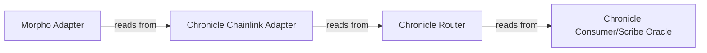

# Deploy a Morpho Market Using Multiple Data Feeds
This guide walks you through deploying a Morpho Adapter yourself when combining multiple data feeds for a given Morpho market. If you are using a **single feed**, the Chronicle team can handle the deployment for you, see [Deploy a Morpho Market Using a Single Chronicle Feed](./morphoMarketOneFeed).

## Background
 Chronicle's Oracles are partially compatible with Chainlink oracles implementing the most widely used (and not deprecated) functions of the IChainlinkAggregatorV3 interface such as latestRoundData(), decimals(), and latestAnswer().

 Because Morpho's oracle infrastructure is built around Chainlink-compatible interfaces, Chronicle oracles require an adapter layer. The [Morpho Chainlink Adapter](https://github.com/morpho-org/morpho-blue-oracles/blob/main/src/morpho-chainlink/MorphoChainlinkOracleV2.sol) enables this compatibility between Chronicle's Oracles and Morpho's infrastructure.

## Architecture Overview

Below is a visualization of the components involved when creating an Oracle for a Morpho market using Chronicle feeds:

### Components

- **Morpho Adapter**: The [MorphoChainlinkOracleV2](https://github.com/morpho-org/morpho-blue-oracles/blob/main/src/morpho-chainlink/MorphoChainlinkOracleV2.sol) contract that Morpho reads from.
- **Chronicle Chainlink Adapter**: A compatibility layer that exposes Chronicle data through Chainlink-compatible interfaces. Only required for Proof of Asset feeds.
- **Chronicle Router**: Routes read requests to the appropriate oracle.
- **Chronicle Consumer/Scribe Oracle**: The underlying Chronicle oracle that produces the price data.

:::note
The Chronicle Chainlink Adapter is only needed for **Proof of Asset** feeds (e.g., [ Morpho market based on a Chronicle Proof of Asset feed](https://app.morpho.org/ethereum/market/0x8d8ab648ffa225f0b6af1c7de5d6bc5f6711771eaa8d48ce6efd83d40281da73/acrdx-usdc)). For DeFi feeds, the Chainlink Adapter reads from the Chronicle Router directly. Please skip Step 1 and go to Step 2 directly.
:::

## Step 1: Get the Chainlink Adapter Address (Proof of Asset Feeds Only)

If your feed is a **Proof of Asset** feed, the Chronicle team will deploy a Chainlink Adapter for you and provide its address. [Open a ticket on Discord](https://discord.com/invite/CjgvJ9EspJ) or reach out via your team's communication channel to request this.

If your feed is a **DeFi feed**, skip this step and proceed to Step 2.

## Step 2: Deploying the Morpho Adapter

Here are are three alternative options for deploying the Morpho Adapter:
:::warning
    **Before deploying the Morpho Chainlink Adapter using the MorphoChainlinkOracleV2Factory, the target address of the Adapter must be whitelisted (also referred to as "kissed")** by the Chronicle team. Read access will fail if the requesting address is not whitelisted, as Chronicle's oracles are protected by a whitelist. To get the address whitelisted, get in touch with the team by [opening a ticket on Discord](https://discord.com/invite/CjgvJ9EspJ), or via your team's own communication channel with Chronicle.
:::

### Option A: Identify the Address of the Morpho Adapter Before Deployment by Simulating Its Deployment

Deploy the Morpho Adapter locally or on a forked network (e.g., using Tenderly or Anvil). The deployment will reveal the pre-computed address. Send that address to the Chronicle team for whitelisting. You can then proceed with the actual deployment of the Morpho Adapter.

### Option B: Provide Deployment Parameters

If you prefer not to simulate the deployment yourself, share the following with the Chronicle team instead and the team will pre-compute the address for you:

- The address of the **[MorphoChainlinkOracleV2Factory](https://github.com/morpho-org/morpho-blue-oracles/blob/main/src/morpho-chainlink/MorphoChainlinkOracleV2.sol)**.
- The [**salt**](https://github.com/morpho-org/morpho-blue-oracles/blob/main/src/morpho-chainlink/MorphoChainlinkOracleV2Factory.sol#L37) you intend to use for the oracle deployment.

The Chronicle team will use this information to pre-compute the Adapter address and whitelist it for you.
Once whitelisted, you can proceed with the actual deployment of the Morpho Adapter.

### Option C: Deploy the Morpho Adapter first, then whitelist it
:::note
Note that the oracle will **not return data** until the whitelisting is complete.
:::

If you prefer not to pre-compute the address, you can deploy the Morpho Adapter first, then share its address with the Chronicle team. The team will whitelist it, after which you can start reading from it. Unlike Options A and B, this means there will be an **extra step between deployment and read access**. Reading from the oracle will revert before the Chronicle team completes the whitelisting.

If you need help with any of the options above, mention it in your [Discord ticket](https://discord.com/invite/CjgvJ9EspJ), or via your team's communication channel, we are happy to support you.

