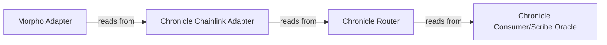

# Deploy a Morpho Market Using a Single Chronicle Feed
[Morpho](https://morpho.org/) uses an oracle-agnostic approach, allowing market creators to choose the price feed mechanisms. All oracles implement the `IOracle` interface with a single standardized function: `price()`. 
Morpho's approach to oracles gives market curators the flexibility to combine multiple data feeds. For the full documentation, please consult the [Morpho docs portal](https://docs.morpho.org/curate/tutorials-market-v1/deploying-oracle/). 
In this section you will find information on how to deploy a Morpho market based on a **single** Chronicle feed.
In the [next section](./morphoMarketMultipleFeeds) you will find information on how to deploy a Morpho market when combining multiple data feeds.

## Background
 Chronicle's Oracles are partially compatible with Chainlink oracles implementing the most widely used (and not deprecated) functions of the IChainlinkAggregatorV3 interface such as latestRoundData(), decimals(), and latestAnswer().

 Because Morpho's oracle infrastructure is built around Chainlink-compatible interfaces, Chronicle oracles require an adapter layer. The [Morpho Chainlink Adapter](https://github.com/morpho-org/morpho-blue-oracles/blob/main/src/morpho-chainlink/MorphoChainlinkOracleV2.sol) enables this compatibility between Chronicle's Oracles and Morpho's infrastructure.

:::warning
    **Before deploying the Morpho Chainlink Adapter using the MorphoChainlinkOracleV2Factory, the target address of the Adapter must be whitelisted (also referred to as "kissed")** by the Chronicle team. Read access will fail if the requesting address is not whitelisted, as Chronicle's oracles are protected by a whitelist. To get the address whitelisted, get in touch with the team by [opening a ticket on Discord](https://discord.com/invite/CjgvJ9EspJ), or via your team's own communication channel with Chronicle.
:::

# Deploying a Morpho Market with a Single Chronicle Feed

To streamline the process for Morpho market creation, **the Chronicle team will deploy and whitelist the required Morpho Adapter on your behalf**. This means you do not need to handle the deployment yourself.

### What You Need to Provide

To get started, [open a ticket on Discord](https://discord.com/invite/CjgvJ9EspJ) or reach out via your team's communication channel with Chronicle, and share:

- The **Chronicle data feed** you want to use (e.g., ETH/USD).
- The **chain** you are deploying on (e.g., Ethereum mainnet).

### What You Will Receive

The Chronicle team will provide you with the **deployed and whitelisted Morpho Adapter address** that you can start reading from using `price()`.
### Architecture Overview

Below is a visualization of the components involved. When the Chronicle team deploys for you, all of these are set up on your behalf:

:::note
The Chronicle Chainlink Adapter component is only needed for Proof of Asset feeds. For DeFi feeds, the Morpho Adapter reads from the Chronicle Router directly.
:::

### Want to Deploy It Yourself?

If you prefer to handle the deployment yourself, you can follow the step-by-step instructions in the [Deploy a Morpho Market Using Multiple Feeds](./morphoMarketMultipleFeeds) guide. The guide covers the full deployment process, including pre-computing the Morpho Adapter address and requesting whitelisting.

