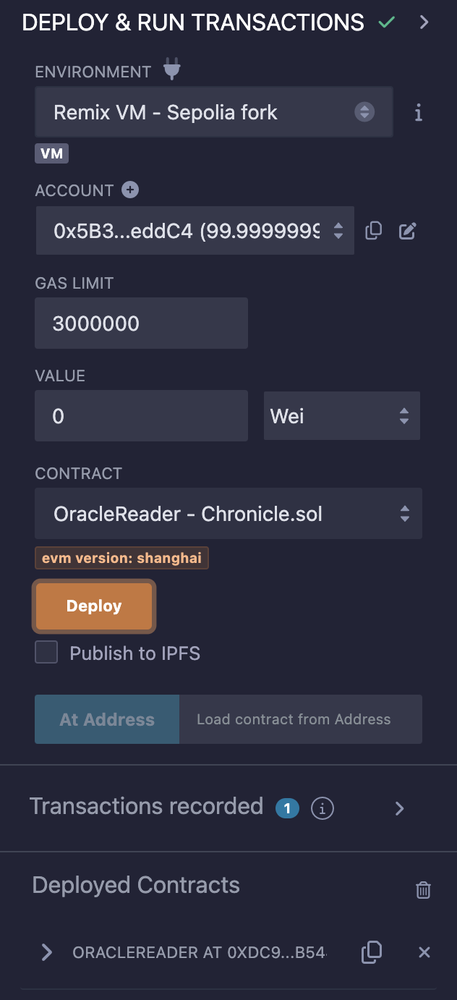

# Remix

### Consuming Oracle Data

An example contract named `OracleReader.sol` allows you to consume Oracle data and can be quickly deployed on [Remix](https://remix.ethereum.org/). Remix is a web-based integrated development environment (IDE) for creating, running, and debugging smart contracts directly in your browser. 

:::info
Addresses in this contract are hardcoded for the Sepolia testnet.
For other supported networks, please check the [Dashboard](https://docs.chroniclelabs.org/).
:::

```js
// SPDX-License-Identifier: MIT
pragma solidity ^0.8.16;

/**
 * @title OracleReader
 * @notice A simple contract to read from Chronicle oracles
 * @dev To see the full repository, visit https://github.com/chronicleprotocol/OracleReader-Example.
 * @dev Addresses in this contract are hardcoded for the Sepolia testnet.
 * For other supported networks, check the https://chroniclelabs.org/dashboard/oracles.
 */
contract OracleReader {
    /**
    * @notice The Chronicle oracle to read from.
    * Chronicle_ETH_USD_3:0xdd6D76262Fd7BdDe428dcfCd94386EbAe0151603
    * Network: Sepolia
    */

    IChronicle public chronicle = IChronicle(address(0xdd6D76262Fd7BdDe428dcfCd94386EbAe0151603));

    /** 
    * @notice The SelfKisser granting access to Chronicle oracles.
    * SelfKisser_1:0x0Dcc19657007713483A5cA76e6A7bbe5f56EA37d
    * Network: Sepolia
    */
    ISelfKisser public selfKisser = ISelfKisser(address(0x0Dcc19657007713483A5cA76e6A7bbe5f56EA37d));

    constructor() {
        // Note to add address(this) to chronicle oracle's whitelist.
        // This allows the contract to read from the chronicle oracle.
        selfKisser.selfKiss(address(chronicle));
    }

    /** 
    * @notice Function to read the latest data from the Chronicle oracle.
    * @return val The current value returned by the oracle.
    * @return age The timestamp of the last update from the oracle.
    */
    function read() external view returns (uint256 val, uint256 age) {
        (val, age) = chronicle.readWithAge();
    }
}

// Copied from [chronicle-std](https://github.com/chronicleprotocol/chronicle-std/blob/main/src/IChronicle.sol).
interface IChronicle {
    /** 
    * @notice Returns the oracle's current value.
    * @dev Reverts if no value set.
    * @return value The oracle's current value.
    */
    function read() external view returns (uint256 value);

    /** 
    * @notice Returns the oracle's current value and its age.
    * @dev Reverts if no value set.
    * @return value The oracle's current value using 18 decimals places.
    * @return age The value's age as a Unix Timestamp .
    * */
    function readWithAge() external view returns (uint256 value, uint256 age);
}

// Copied from [self-kisser](https://github.com/chronicleprotocol/self-kisser/blob/main/src/ISelfKisser.sol).
interface ISelfKisser {
    /// @notice Kisses caller on oracle `oracle`.
    function selfKiss(address oracle) external;
}
```

Ensure your environment is set to **Remix VM - Sepolia Fork** (since this example is hardcoded for Sepolia).

import deploy from '../../../static/img/remix_deploy.png'
import result from '../../../static/img/remix_result.png'

<div class="text--center"> 

</div>
<!--  -->

Deploy the `OracleReader.sol` contract and you should see the following:
- **chronicle**: returns ` 0xdd6D76262Fd7BdDe428dcfCd94386EbAe0151603`, which is the address of the `Chronicle_ETH_USD_3` Oracle
- **read**: returns the current price (3533995000000000000000) and its age (1718091840) at the moment of calling.

Note: the price uses 18 decimals, meaning that the actual price is 3533.995. Age uses Unix Timestamp, meaning that 1718091840 corresponds to 'Tue Jun 11 2024 07:44:00 GMT'.

- **selfKisser**: returns the address of the SelfKisser `0x0Dcc19657007713483A5cA76e6A7bbe5f56EA37d`

<div style={{textAlign: 'center'}}>

</div>
