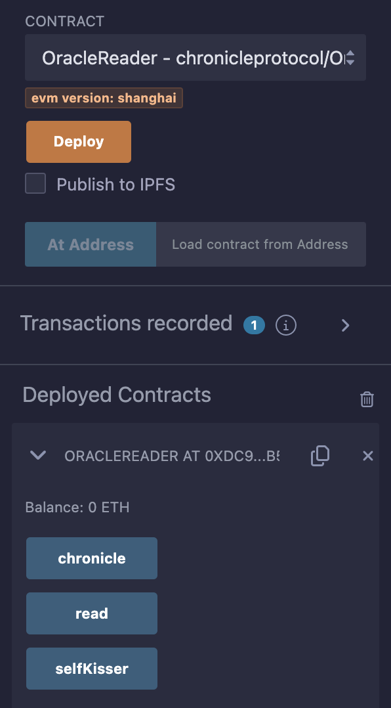

# Remix

### Chronicle + Remix 

A contract example named OracleReader.sol which you can easily deploy on REMIX.

See below for details.

```solidity
// SPDX-License-Identifier: MIT
pragma solidity ^0.8.16;

/**
 * @title OracleReader
 *
 * @notice A simple contract to read from Chronicle oracles
 *
 * @dev To see the full repository, visit https://github.com/chronicleprotocol/OracleReader-Example.
 *
 * @dev Addresses in this contract are hardcoded for the Sepolia testnet.
 *      For other supported networks, see https://docs.chroniclelabs.org/.
 */
contract OracleReader {
    /// @notice The Chronicle oracle to read from.
    IChronicle public chronicle = IChronicle(address(0xdd6D76262Fd7BdDe428dcfCd94386EbAe0151603));

    /// @notice The SelfKisser granting access to Chronicle oracles.
    ISelfKisser public selfKisser = ISelfKisser(address(0x0Dcc19657007713483A5cA76e6A7bbe5f56EA37d));

    constructor() {
        // Note to add address(this) to chronicle oracle's whitelist.
        // This allows the contract to read from the chronicle oracle.
        selfKisser.selfKiss(address(chronicle));
    }

    /// @notice Function to read the latest data from the Chronicle oracle.
    /// @return val The current value returned by the oracle.
    /// @return age The timestamp of the last update from the oracle.
    function read() external view returns (uint256 val, uint256 age) {
        (val, age) = chronicle.readWithAge();
    }
}

// Copied from [chronicle-std](https://github.com/chronicleprotocol/chronicle-std/blob/main/src/IChronicle.sol).
interface IChronicle {
    /// @notice Returns the oracle's current value.
    /// @dev Reverts if no value set.
    /// @return value The oracle's current value.
    function read() external view returns (uint256 value);

    /// @notice Returns the oracle's current value and its age.
    /// @dev Reverts if no value set.
    /// @return value The oracle's current value.
    /// @return age The value's age.
    function readWithAge() external view returns (uint256 value, uint256 age);
}

// Copied from [self-kisser](https://github.com/chronicleprotocol/self-kisser/blob/main/src/ISelfKisser.sol).
interface ISelfKisser {
    /// @notice Kisses caller on oracle `oracle`.
    function selfKiss(address oracle) external;
}
```

Ensure you're enviroment is set to Remix VM - Sepolia Fork (since this example has been hardcoded to Sepolia) 
```
@dev Addresses in this contract are hardcoded for the Sepolia testnet.
 For other supported networks, see https://docs.chroniclelabs.org/.
 
```

import deploy from '../../../static/img/remix_deploy.png'
import result from '../../../static/img/remix_result.png'

<div class="text--center"> 

</div>
<!--  -->

Deploy the OracleReader.sol contract and you should see you're successfully deployed contracts showing
- chronicle 
- read
- selfKisser
<div class="text--center"> 

</div>
<!--  -->