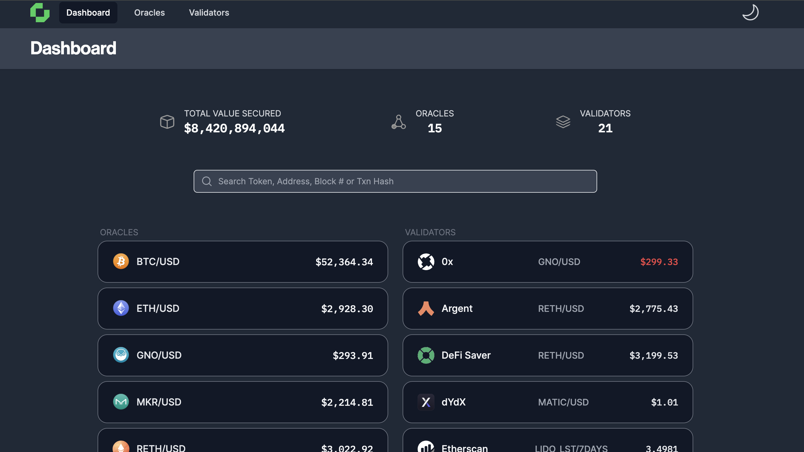

 # Architecture

  The Chronicle's Oracle protocol comprises a distributed architecture spanning various on-chain and off-chain components. The diagram below highlights both types of components, with off-chain components depicted with a green background on the left-hand side, and on-chain components with a beige background on the right-hand side. Origins, such as primary data sources, can exist on both on-chain and off-chain layers.

    

 ## On-Chain components

    - **WatRegistry** is a Smart Contract designed to manage data models, particularly in the context of MultiSig (multi-signature) validation. Here's a breakdown of the information it stores for each data model:

    - **List of Validators**: This refers to the entities or individuals who are authorized to participate in the MultiSig validation process for a particular data model. MultiSig validation typically requires multiple parties to sign off on a transaction or data update before it is considered valid. The list of validators outlines who these authorized parties are.
    - **Quorum**: This represents the minimum number of validations or "feeds" required for a MultiSig validation to be considered valid for a specific data model. For example, if the quorum for a particular data model is set to 11, it means that at least 11 out of the total number of validators listed must sign off on the transaction or data update for it to be accepted.
    
     By storing this information for each data model, **WatRegistry** ensures that the MultiSig validation process is conducted according to the specified requirements for each particular data model. Chronicle Protocol facilitates the dynamic updating of configurations for feeds using the Chronicles Go-based Oracle client. **ConfigRegistry** assigns a unique URL to each individual feed. This unique URL mechanism allows for the management of distinct configurations for every feed. In essence, the **ConfigRegistry** serves as a central repository where configuration information for each feed is stored and can be updated as needed. By maintaining this registry, Chronicle Protocol ensures that each feed can have its own specific configuration settings tailored to its requirements, enhancing flexibility and customization within the protocol

    - **FeedRegistry** plays a crucial role within the **Chronicle Protocol** by maintaining a comprehensive list of all Feeds that are recognized as valid participants in the network/protocol. Feeds, in this context, are trusted entities within the network that collaborate through a *peer-to-peer* (p2p) network to supply new oracle data.

    - An on-chain enforced consensus mechanism ensures that data provided by these Feeds is validated by a specific number, known as the `bar` of Feeds. As a singleton contract deployed on the Ethereum blockchain, the **FeedRegistry** serves as a centralized source of truth regarding the identities of valid Feeds within the Chronicle Protocol. Feeds regularly query this registry to determine their status within the network. Additionally, the registry provides functionalities such as filtering p2p connections based on the identities of Feeds and translating feed addresses to/from their corresponding 1-byte identifier.
    By leveraging the **FeedRegistry**, Chronicle Protocol ensures that only authenticated and authorized Feeds participate in the network activities, thereby enhancing the security and integrity of the oracle data provided by the protocol.

    ## Off-Chain components 

    Validator (aka Feed) Creates usable information our of raw data that is read from various Origins. Validators query Origins no matter whether they are on-chain or off-chain for the price data. The Validator transform the original data into Chronicle data by using Data Models. After the Chronicle data is calculated it is signed and sent to the peer-to-peer network.

    **Challenger** is an off chain component that listens to Oracle’s updates and makes sure that no invalid optimistic update is made. Thus we can be sure that our Optimistic Oracles are functioning properly.

    **Origins** are the data sources about the assets prices that can exist on chain (DEX) such as UniSwap, dYdX, Balancer, etc. or be off chain from CEXs ( e.g. Kraken, Binance, Coinbase).

    **Relays** collect data from Validators/Feeds and compose EVM transactions out of it. Subsequently, these EVM transactions with the Feeds data is sent to a blockchain. 

    **Archiver** aggregates the messages created by Validators and stores it in a database. It collect all signed messages, not the intermediate messages like used for MuSig creating.

    **Dashboard**:  The [**croniclelabs.org](http://croniclelabs.org) web site** queries the archiver to present the prices on its dashboard. You can find all of our current Oracles here https://chroniclelabs.org/dashboard/oracles

    You can find your token name by using the search box or by selecting your preferred blockchain from the filter located in the top-right corner (see Figure below).

    
