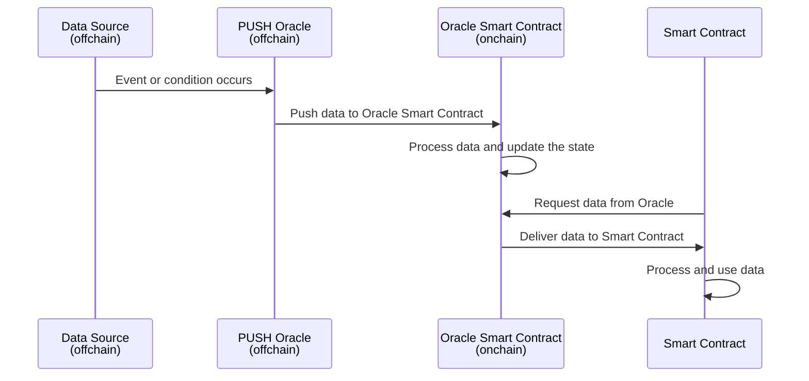

# PUSH Oracles

**Chronicle uses a PUSH model for its Oracles.**

## How do PUSH Oracles Work?
PUSH oracles actively deliver data to smart contracts without needing an explicit request. Upon the occurrence of a specific event or condition, the PUSH oracle automatically triggers the smart contract with the relevant data. For example, a PUSH Oracle might send price data to a smart contract every X minutes/hours, or whenever the price deviates by a certain percentage from its previous value.

