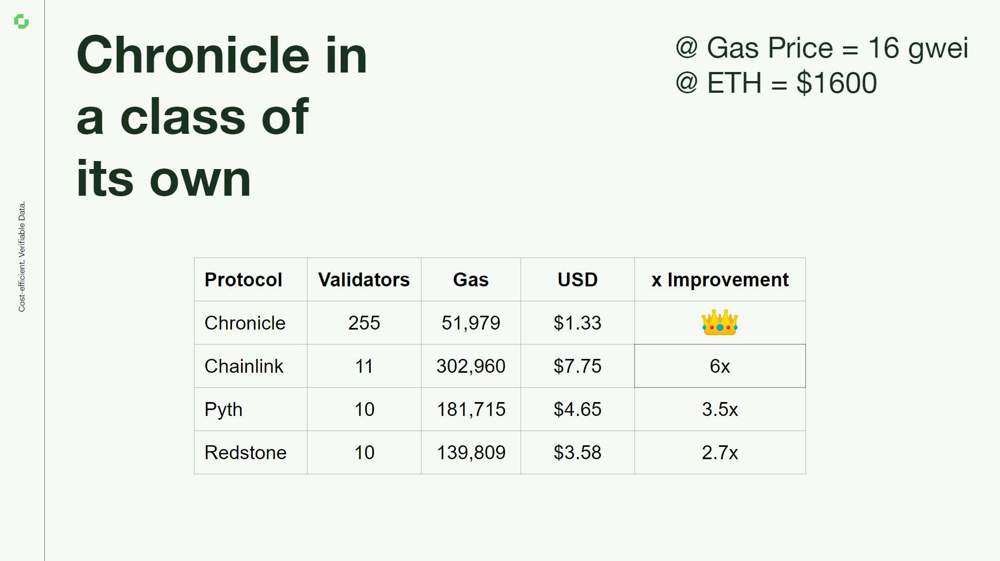

# Scribe 

Scribe is an extremely gas-efficient Oracle based on aggregated Schnorr signatures. Providing nearly constant gas costs on Layer 2s and on Layer 1s, Scribe boasts of fixed gas costs, leading to substantial savings—over 60% relative to competing Oracles and an impressive 80% compared to Chainlink. This approach to gas management significantly boosts the scalability of the Oracle.

The Chronicle Scribe Oracle interface is plug-and-play with Chainlink and Maker Oracles, providing a smooth transition for developers used to these platforms.

All data delivered by a Chronicle Oracle on mainnet is verifiable via The Chronicle Dashboard.

Scribe Public Repo: https://github.com/chronicleprotocol/scribe

detail 