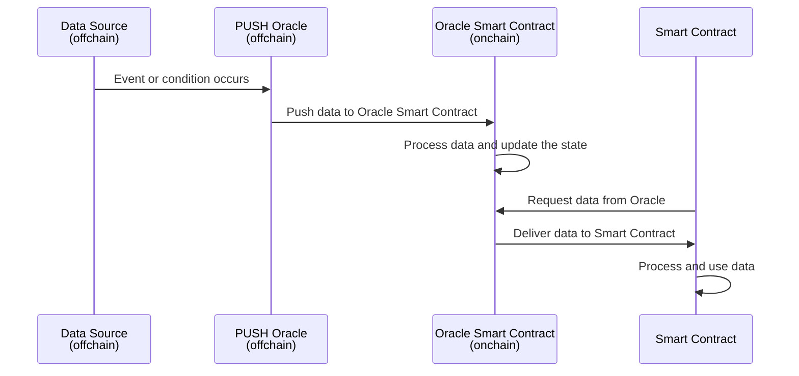

# DeFi Oracle

You can use Chronicle's PUSH-based DeFi Oracles to connect your smart contracts to real-time asset pricing data. Our oracles proactively deliver fresh data without requiring explicit requests, ensuring your contracts always have the latest information.

Data is aggregated from a decentralized network of reputable validators, sourcing from both onchain and offchain providers, including DEXs and CEXs. Chronicle Oracles support a wide range of data types, including cryptocurrencies, fiat currencies, yield rates, and more.

## How Does a  PUSH Oracle Work?

Protocol validators fetch data from different sources. The data used is verifiable and identifiable to its underlying source. This functionality is available to both decentralized sources (like DEXes) and centralized sources (like CEXes). Validators sign and publish this data on an offchain peer-to-peer network. After publication, the data is aggregated through an aggregation mechanism (e.g. the median of medians), to eliminate outliers and determine the final value to be published onchain. Data is then published onchain based on a [predefined threshold](#oracle-updates). Once onchain, this data can be consumed by any dApps that read from the oracle smart contract.

    

    

### When Does an Oracle Update? {#oracle-updates}

PUSH oracles actively deliver data to smart contracts without requiring an explicit request. Upon the occurrence of a specific event or condition, the PUSH oracle automatically updates the oracle smart contract with the new data. For example, a PUSH Oracle might update price data every X minutes/hours, or whenever the underlying price deviates beyond a specified threshold.

