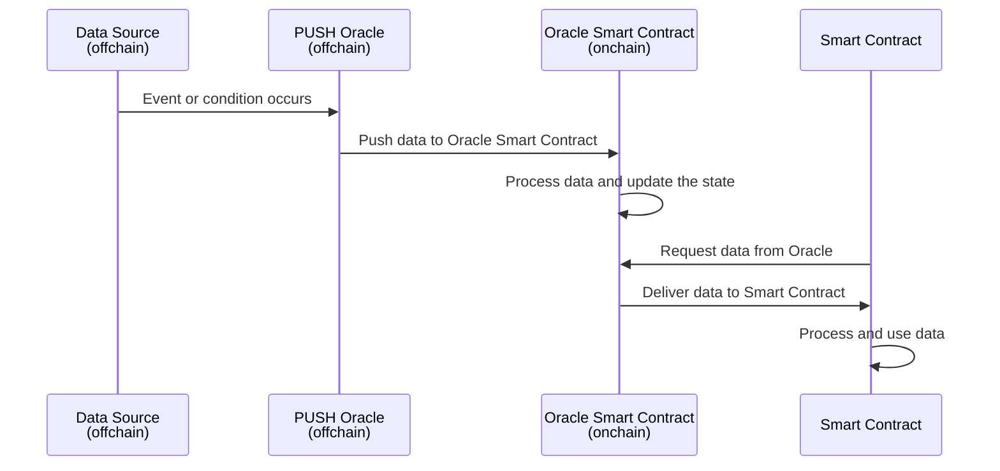

# PUSH Oracle

## How Does a  PUSH Oracle Work?

Protocol validators fetch data from different sources. The data used is verifiable and identifiable to the its underlying source. This functionality is available to both decentralized sources (like DEXes) and centralized sources (like CEXes). Validators sign and publish this data on an offchain peer-to-peer network. After publication, the data is aggregated through an aggregation mechanism (e.g. the median of medians), to eliminate outliers and determine the final value to be published onchain. Data is then published onchain based on a [predefined threshold](#oracle-updates). Once onchain, this data can be consumed by any dApps that read from the oracle smart contract.

    

    

### When Does an Oracle Update? {#oracle-updates}

PUSH oracles actively deliver data to smart contracts without requiring an explicit request. Upon the occurrence of a specific event or condition, the PUSH oracle automatically updates the oracle smart contract with the new data. For example, a PUSH Oracle might update price data every X minutes/hours, or whenever the underlying price deviates beyond a specified threshold.

